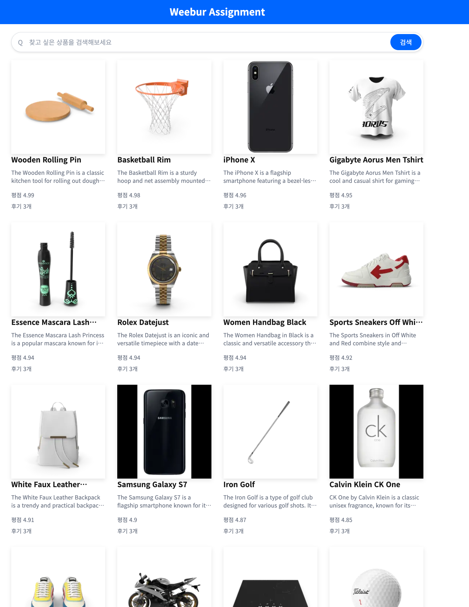
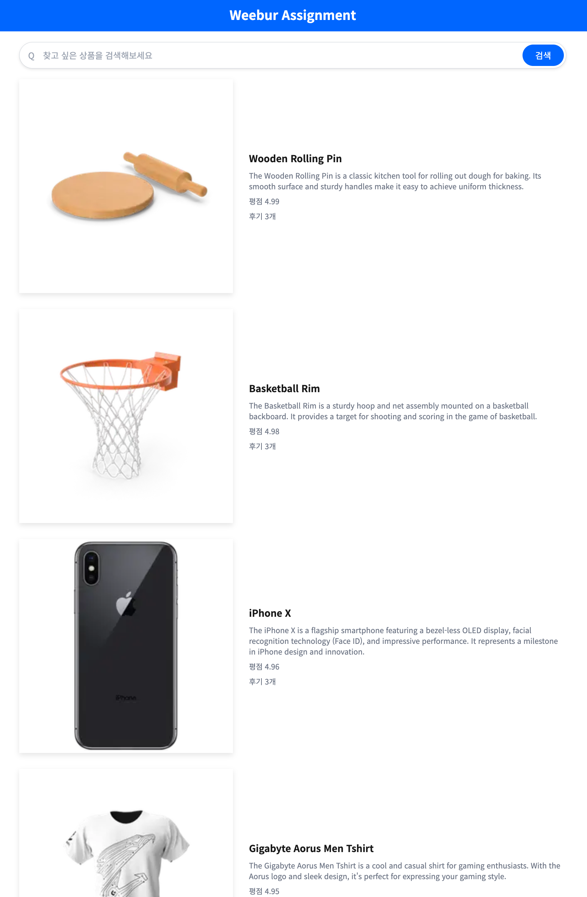
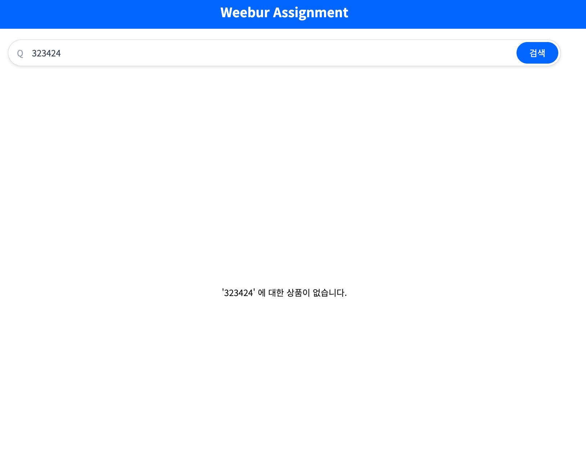
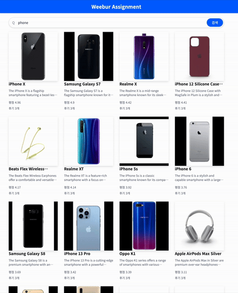
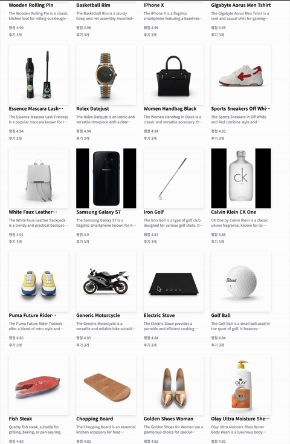
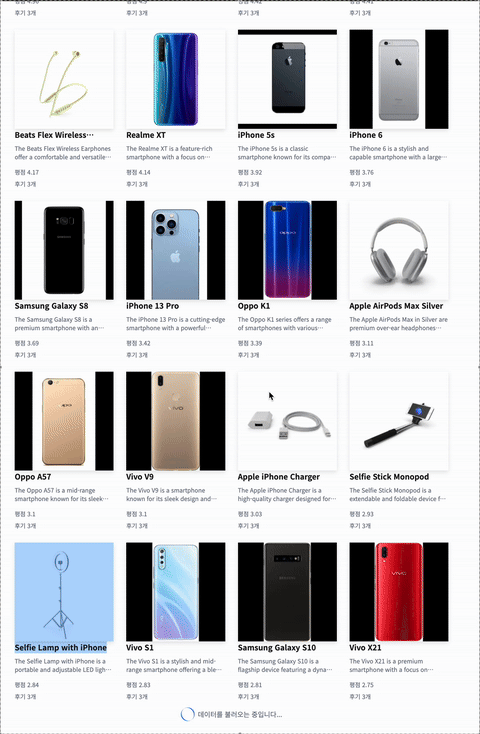

# Weebur Assignment

## 요구사항 구현

- [x] 페이지 진입 시 20개의 아이템이 기본적으로 노출
- [x] 각 아이템은 상품명, 상품설명, 썸네일 이미지, 별점, 리뷰수를 표시
- [x] 페이지 최초 진입 시 50%의 확률로 리스트형, 그리드형의 뷰 형태로 상품을 나열
- [x] 뷰 형태는 24시간 마다 갱신하여 50%의 랜덤 확률로 갱신
- [x] 검색 필터 통해 문자열로 상품 검색 기능
- [x] 기본적으로 내림차순으로 아이템을 정렬
- [x] 페이지 새로고침 후에도 필터 값이 유지
- [x] 검색 결과가 없을 경우 문구 표현
- [x] 페이지 하단 도달 시 20개의 아이템이 자동으로 로드
- [x] 필터 결과에도 무한 스크롤 적용
- [x] 마지막 데이터까지 로딩되면 문구 표시

## 기능 프리뷰

### 페이지 리스트

- 리스트, 그리드 형태의 뷰로, 기본적으로 20개의 아이템을 나열

<div style="display: flex; gap: 10px;">
  
  
</div>

- 데이터가 없거나 에러 발생 시 문구 표시



### 검색 필터

- 검색어를 입력하면 해당 검색어와 관련된 아이템을 나열하고 새로고침 후에도 해당 아이템을 유지



### 무한 스크롤

- 페이지 하단 도달 시 아이템을 계속해서 나열



- 더 이상 불러올 데이터가 없을 경우 문구를 표시



## 프로젝트 디렉토리

```
├── apis                # API 호출 관련 로직
├── app                 # Next.js 앱(앱 라우터 방식)
├── components          # 컴포넌트
│   ├── common          # 공통 컴포넌트 (재사용 가능한 UI 요소)
│   ├── layout          # 레이아웃 컴포넌트 (헤더, 프로바이더 등)
│   └── pages           # 페이지별 컴포넌트
├── data                # react-query를 활용한 데이터 hook
├── hooks               # React custom hook
├── libs                # 공통 유틸리티 및 타입 정의
│   └── type.ts         # TypeScript 타입 정의
├── store               # 상태 관리, Zustand 스토어
├── stories             # Storybook 파일
│   └── common          # 공통 컴포넌트 관련
└── styles              # 글로벌 스타일 설정 파일
```

## 실행

- 패키지 설치

```bash
npm install
```

- 프로젝트 실행

```bash
npm run dev
```

- 스토리북 실행

```bash
npm run storybook
```

## 중점 사항

### 효율적으로 구현한 무한스크롤

무한 스크롤을 구현하면서 성능 최적화에 중점을 두었습니다.

먼저 react-query를 활용하여 비동기 요청을 캐싱하여 중복 요청과 오류를 방지하고자 했습니다.

스크롤 위치 감지에 scroll 이벤트가 아닌 브라우저 내장 API인 IntersectionObserver을 활용했습니다. 스크롤 이벤트는 이벤트 리스너를 통해 실행하기 때문에 상대적으로 빈번하게 실행되지만 IntersectionObserver는 브라우저가 타겟 요소와 교차 여부를 비동기적으로 계산하여 리소스가 개선되는 이점이 있기 때문입니다.

마지막으로 아이템들을 렌더링하는 중에 이미 렌더링된 아이템들의 리렌더링을 방지하고자 React.memo를 통해 메모이제이션하여 불필요한 리렌더링을 방지했습니다.

### Storybook 기반으로 카드 컴포넌트를 독립적으로 구현

Storybook을 통해 아이템 UI를 보여주는 Card 컴포넌트를 구현했습니다.

Card 컴포넌트는 공통 컴포넌트 요소로 재사용성이 높아야하기 때문에 초기 구현 시 Storybook을 기반하여 독립적으로 개발하여 컴포넌트의 외부 의존성을 줄여 공통 컴포넌트 역할에 맞게 구현했습니다.

### Suspense와 스켈레톤을 활용하여 사용자 경험 개선

Suspense를 활용하여 비동기 데이터를 활용하는 CardSection 컴포넌트에 적용하여 비동기 상태를 제어했습니다.

Suspense의 fallback으로 스켈레톤 UI를 적용하여 데이터 로딩 중 사용자에게 UI를 제공해 사용자 경험 개선을 기대했습니다.
